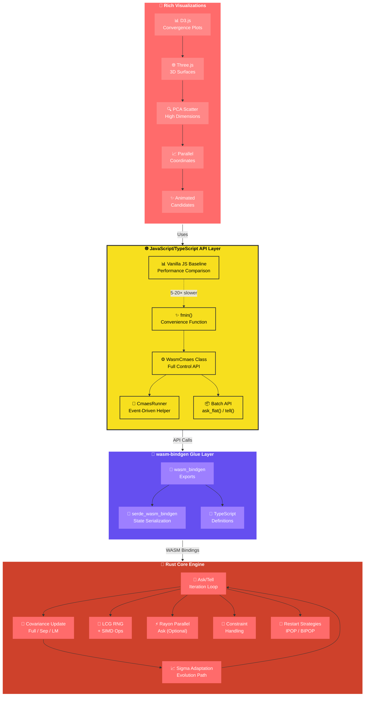

<div align="center">

# 🦀 wasm_cmaes

**Hyper-optimized CMA-ES in Rust compiled to WebAssembly**

[](https://dicklesworthstone.github.io/wasm_cmaes/examples/viz-benchmarks.html)
[](https://www.npmjs.com/package/cmaes_wasm)
[](https://www.rust-lang.org/)
[](LICENSE-MIT)
[](https://github.com/rustwasm/wasm-pack)

**🚀 [Live Demo](https://dicklesworthstone.github.io/wasm_cmaes/examples/viz-benchmarks.html)** • **📦 [npm Package](https://www.npmjs.com/package/cmaes_wasm)** • **📚 [Documentation](#table-of-contents)**

</div>

---

Hyper-optimized **CMA-ES** (Covariance Matrix Adaptation Evolution Strategy) in Rust compiled to WebAssembly with a first-class JavaScript/TypeScript experience. **SIMD acceleration**, optional **Rayon parallelism**, **deterministic seeds**, **batch API**, and a world-class visual playground (D3 + Tailwind + Three.js) — all running natively in the browser with zero server dependencies.

**Latest release:** `v0.2.0` • Published to npm as `cmaes_wasm` and `cmaes_wasm-par`

## Table of contents

- [Why CMA-ES](#why-cma-es)
- [Architecture (Mermaid)](#architecture-mermaid)
- [Features](#features)
- [Installation](#installation)
- [Quickstart](#quickstart)
- [API reference](#api-reference)
- [Advanced usage](#advanced-usage)
- [Building](#building)
- [Visual demos](#visual-demos)
- [Benchmarks](#benchmarks)
- [Performance considerations](#performance-considerations)
- [Project layout](#project-layout)
- [Deployment](#deployment)
- [Contributing](#contributing)
- [License](#license)

## 🎯 Why CMA-ES?

CMA-ES is a **state-of-the-art derivative-free optimization algorithm** that excels where gradient-based methods fail:

| Feature | Description |
|---------|-------------|
| 🚫 **Derivative-free** | No gradients needed; handles noisy, non-convex, multi-modal, and discontinuous landscapes effortlessly |
| 🔄 **Adaptive** | Automatically adapts step size (`sigma`) and covariance matrix to follow curved valleys, ridges, and complex topologies |
| ⚡ **Parallel-friendly** | Candidate evaluations are embarrassingly parallel, perfect for Web Workers and distributed computing |
| 🛡️ **Robust** | Handles ill-conditioned problems, constraints, noisy objectives, and high-dimensional search spaces |
| ✅ **Proven** | Widely used in machine learning hyperparameter tuning, robotics, control systems, and scientific computing |

### ⚡ How it works (30-second crash course)

> **The algorithm's power comes from its ability to learn the problem structure through covariance adaptation, making it particularly effective for non-separable and ill-conditioned problems.**

1. **🎲 Sampling**: Generates λ candidate solutions from a multivariate normal distribution centered at the current mean, scaled by `sigma` and shaped by the covariance matrix.

2. **📊 Evaluation**: Ranks candidates by fitness (lower is better for minimization).

3. **🔄 Update**: Updates the mean using weighted recombination of the best μ candidates; adapts covariance matrix to capture search space structure.

4. **📈 Step-size adaptation**: Adjusts `sigma` via cumulative evolution path tracking to balance exploration and exploitation.

5. **🛑 Termination**: Stops on max evaluations, target fitness (`ftarget`), ill-conditioning, or tolerance thresholds (`tolFun`, `tolX`).

## 🏗️ Architecture



## ✨ Features

### 🚀 Core optimization capabilities

| Feature | Description |
|---------|-------------|
| **🎯 Multiple API styles** | High-level `fmin()` convenience function, `WasmCmaes` class for full control, and `CmaesRunner` helper for event-driven runs with callbacks |
| **📦 Dual bundle strategy** | Sequential (`cmaes_wasm`) for maximum compatibility and parallel (`cmaes_wasm-par`) with Rayon for multi-core acceleration |
| **⚡ SIMD acceleration** | Portable SIMD (`+simd128`) for wasm32 targets accelerates dot products, matrix operations, and vector norms |
| **📐 Covariance models** | **Auto** (smart selection), **Full** (<50 dim), **Separable** (50-200 dim), **Limited-memory** (>200 dim) |
| **🔊 Noise-aware optimization** | Robust sampling with adaptive multi-sample strategies, noisy-run labeling, and automatic sigma expansion |
| **🚧 Constraint handling** | **Penalty** (augmented Lagrangian), **Projection** (clamp to bounds), **Resample** (reject infeasible) |
| **🔄 Restart strategies** | IPOP (increasing population) and BIPOP (bi-population) for escaping local minima |
| **🎲 Deterministic seeds** | Seeded LCG ensures reproducible runs and benchmark comparisons |
| **📦 Batch API** | `ask_flat()` returns all λ candidates in single `Float64Array`, minimizing JS↔WASM crossings |
| **💾 State serialization** | Save/restore optimizer state via `serde-wasm-bindgen` for checkpointing and sharing |

### 🎨 Visualization and UX

| Feature | Details |
|---------|---------|
| **📊 Rich interactive dashboard** | D3.js convergence plots, Three.js 3D surfaces, PCA scatter, parallel coordinates, animated candidates |
| **🔀 Multi-run comparisons** | Overlay prior runs, pin/compare modes, HUD deltas, comprehensive statistics tracking |
| **🔗 Presets & sharing** | Curated presets, recent runs history, shareable config URLs |
| **📚 Onboarding system** | Quickstart carousel, learn-mode badges, comprehensive glossary, mobile-responsive UI |
| **📱 Mobile-first design** | Touch-optimized controls, swipe gestures, bottom sheet UI, progressive enhancement |
| **♿ Accessibility** | WCAG 2.1 AA+ compliance, ARIA labels, keyboard navigation, screen reader support |
| **⚡ Performance baseline** | Vanilla JS implementation for comparison (5-20× slower than WASM) |

## 📦 Installation

### 📥 From npm

```bash
npm install cmaes_wasm
# or for parallel builds:
npm install cmaes_wasm-par
```

### 🛠️ Local development (no bundler required)

Clone the repository and serve locally:

```bash
git clone https://github.com/Dicklesworthstone/wasm_cmaes.git
cd wasm_cmaes
python -m http.server 8000
# open http://localhost:8000/examples/viz-benchmarks.html
```

> **Note:** The `pkg/` and `pkg-par/` directories contain pre-built bundles (tracked for GitHub Pages deployment).

### 📦 With a bundler (Vite, Webpack, etc.)

```typescript
import init, { fmin } from "cmaes_wasm";

await init();
// Use fmin() or other APIs
```

## 🚀 Quickstart

### 💡 Minimal example (convenience function)

```typescript
import init, { fmin } from "./pkg/cmaes_wasm.js";

await init();

// Minimize a simple 2D sphere function
const res = fmin(
  new Float64Array([3, -2]),  // starting point
  0.8,                         // initial step size (sigma)
  (x) => x[0] * x[0] + x[1] * x[1]  // objective function
);

console.log("Best fitness:", res.best_f);
console.log("Best solution:", res.best_x());
console.log("Evaluations:", res.evals);
console.log("Iterations:", res.iterations);
```

### ⚙️ Class API (full control)

```typescript
import init, { WasmCmaes, CmaesOptions } from "./pkg/cmaes_wasm.js";

await init();

const options = new CmaesOptions();
options.popsize = 32;           // population size (lambda)
options.maxEvals = 10000;       // maximum function evaluations
options.ftarget = 1e-12;         // target fitness (stops early if reached)
options.seed = 42;               // random seed for reproducibility
options.covarModel = "full";     // covariance model: "auto" | "full" | "sep" | "lm"

const es = new WasmCmaes(
  new Float64Array([0.5, -0.2, 0.8]),  // starting point
  0.3,                                  // initial step size
  options
);

// Manual ask/tell loop
while (!es.stop_status().stopped) {
  const candidates = es.ask_flat();  // Get all candidates in flat array
  const fitnesses = new Float64Array(es.lambda);
  
  // Evaluate candidates (can be parallelized with Web Workers)
  for (let k = 0; k < es.lambda; k++) {
    const offset = k * es.dimension;
    const x = candidates.subarray(offset, offset + es.dimension);
    fitnesses[k] = x[0] * x[0] + x[1] * x[1] + x[2] * x[2];  // Sphere function
  }
  
  es.tell_flat(fitnesses);  // Submit fitness values
}

const result = es.result();
console.log("Best solution:", result.best_x());
console.log("Best fitness:", result.best_f);
console.log("Covariance matrix:", es.cov_matrix());  // For visualization
```

### 🎯 Runner helper (event-driven)

```typescript
import { runCmaes } from "./cmaes_runner";

const result = await runCmaes(
  new Float64Array([0, 0]),
  0.2,
  (x) => x[0] * x[0] + x[1] * x[1],
  {
    onIteration: (res) => {
      console.log(`Iteration ${res.iterations}: best = ${res.best_f}`);
    },
    onImprovement: (res) => {
      console.log("New best found:", res.best_f);
    },
    onTermination: (res) => {
      console.log("Optimization complete:", res);
    }
  }
);
```

## 📚 API Reference

### `fmin(xstart, sigma, objective, options?)`

High-level convenience function that runs CMA-ES to completion.

**Parameters:**
- `xstart: Float64Array` — Starting point (initial guess)
- `sigma: number` — Initial step size (typically 0.1–1.0 × search range)
- `objective: (x: Float64Array) => number` — Objective function to minimize
- `options?: CmaesOptions` — Optional configuration

**Returns:** `FminResult` with `best_f`, `best_x()`, `evals`, `iterations`, `xmean()`, `stds()`

### `fmin_restarts(xstart, sigma, objective, options?)`

Runs CMA-ES with IPOP/BIPOP restart strategy for escaping local minima.

**Parameters:** Same as `fmin()`

**Returns:** `FminResult` (best across all restarts)

### `WasmCmaes` class

Full-featured optimizer class for manual control.

**Constructor:** `new WasmCmaes(xstart: Float64Array, sigma: number, options?: CmaesOptions)`

**Methods:**
- `ask(): Array<Float64Array>` — Get candidates as array of vectors
- `ask_flat(): Float64Array` — Get all candidates in flat array (λ × dimension)
- `tell(fitnesses: Float64Array): void` — Submit fitness values (use with `ask()`)
- `tell_flat(fitnesses: Float64Array): void` — Submit fitness values (use with `ask_flat()`)
- `stop_status(): StopStatus` — Check termination conditions
- `result(): FminResult` — Get current best result
- `cov_matrix(): Float64Array` — Get covariance matrix (for visualization)
- `to_json_state(): any` — Serialize state to JSON

**Properties:**
- `dimension: number` — Problem dimension
- `lambda: number` — Population size

### `CmaesOptions` interface

```typescript
interface CmaesOptions {
  popsize?: number;              // Population size (lambda), default: auto
  maxEvals?: number;             // Max function evaluations
  ftarget?: number;               // Target fitness (stops early)
  seed?: number;                  // Random seed (0 = random)
  covarModel?: CovarianceModel;   // "auto" | "full" | "sep" | "lm"
  strategy?: StrategyMode;        // "auto" | "classic"
  bounds?: Bounds;                // { lower?: Float64Array, upper?: Float64Array }
  constraintPenalty?: number;    // Penalty weight for constraints
  noise?: NoiseOptions;           // Noise handling configuration
  restartStrategy?: RestartStrategy;  // "none" | "ipop" | "bipop"
  maxRestarts?: number;           // Max restart attempts
  maxTotalEvals?: number;         // Total eval budget across restarts
}
```

### `wasm_cmaes_from_state(state: any): WasmCmaes`

Restore optimizer from serialized state (useful for checkpointing).

## 🔧 Advanced Usage

### ⚡ Parallel evaluation with Web Workers

For true parallelism, use the parallel bundle with Web Workers:

```typescript
import init, { WasmCmaes } from "./pkg-par/cmaes_wasm.js";
import { initThreadPool } from "./pkg-par/cmaes_wasm.js";

await init();
await initThreadPool(navigator.hardwareConcurrency);  // Initialize thread pool

const es = new WasmCmaes(/* ... */);

// Rayon will parallelize ask() internally if atomics are enabled
const candidates = es.ask_flat();

// Evaluate in parallel with Web Workers
const workers = Array.from({ length: navigator.hardwareConcurrency }, () => 
  new Worker("evaluator-worker.js")
);

const fitnesses = await Promise.all(
  candidates.map((candidate, i) => 
    evaluateInWorker(workers[i % workers.length], candidate)
  )
);

es.tell_flat(new Float64Array(fitnesses));
```

**Note:** Parallel builds require:
- Browser support for SharedArrayBuffer and WebAssembly threads
- `Cross-Origin-Opener-Policy: same-origin` and `Cross-Origin-Embedder-Policy: require-corp` headers
- Thread pool initialization: `await initThreadPool(n)`

### 🚧 Constraints

```typescript
const options = new CmaesOptions();
options.bounds = {
  lower: new Float64Array([-1, -1, -1]),
  upper: new Float64Array([1, 1, 1])
};
options.constraintPenalty = 1000;  // For penalty method

const es = new WasmCmaes(x0, sigma, options);
```

Constraint strategies:
- **Penalty**: Adds penalty term to fitness for infeasible candidates
- **Projection**: Clamps candidates to feasible bounds
- **Resample**: Rejects infeasible candidates and resamples (with retry limit)

### 🔊 Noise handling

```typescript
const options = new CmaesOptions();
options.noise = {
  samplesPerPoint: 5,        // Evaluate each candidate multiple times
  adaptive: true,            // Automatically adjust sampling
  maxSamplesPerPoint: 10     // Upper limit on samples
};

const es = new WasmCmaes(x0, sigma, options);
```

Noise-aware mode:
- Multi-sample evaluation for robust fitness estimates
- Adaptive sampling based on detected noise level
- Automatic sigma expansion for noisy landscapes

### Covariance model selection

```typescript
const options = new CmaesOptions();

// Auto-select based on dimension
options.covarModel = "auto";

// Full covariance (best for low-medium dimensions)
options.covarModel = "full";

// Separable/diagonal (fast for high dimensions)
options.covarModel = "sep";

// Limited-memory (memory-efficient for very high dimensions)
options.covarModel = "lm";

const es = new WasmCmaes(x0, sigma, options);
```

**Guidelines:**
- **Full**: Use for dimensions < 50, captures full correlations
- **Separable**: Use for dimensions 50–200, assumes independence
- **Limited-memory**: Use for dimensions > 200, memory-efficient approximation

### 🔄 Restart strategies

```typescript
const options = new CmaesOptions();
options.restartStrategy = "bipop";  // or "ipop" | "none"
options.maxRestarts = 10;
options.maxTotalEvals = 100000;

const result = fmin_restarts(x0, sigma, objective, options);
```

- **IPOP**: Increasing population size with each restart
- **BIPOP**: Bi-population strategy with varying population sizes
- Useful for escaping local minima in multi-modal landscapes

### 💾 State serialization and checkpointing

```typescript
// Save state
const state = es.to_json_state();
localStorage.setItem("cmaes_state", JSON.stringify(state));

// Or save to file
const blob = new Blob([JSON.stringify(state)], { type: "application/json" });
const url = URL.createObjectURL(blob);
// Download or send to server

// Restore state
import { wasm_cmaes_from_state } from "./pkg/cmaes_wasm.js";

const savedState = JSON.parse(localStorage.getItem("cmaes_state"));
const es = wasm_cmaes_from_state(savedState);

// Continue optimization
while (!es.stop_status().stopped) {
  // ... ask/tell loop
}
```

### 🎯 Custom objective functions

```typescript
// 2D Rosenbrock function
const rosenbrock = (x: Float64Array) => {
  let sum = 0;
  for (let i = 0; i < x.length - 1; i++) {
    const a = x[i];
    const b = x[i + 1];
    sum += 100 * (b - a * a) ** 2 + (1 - a) ** 2;
  }
  return sum;
};

const res = fmin(new Float64Array([-1.5, 1.2]), 0.6, rosenbrock);
```

**Best practices:**
- Keep objectives pure (no side effects)
- Handle edge cases (NaN, Infinity)
- Use `Float64Array` for vector operations when possible
- Consider vectorization for batch evaluation

## 🔨 Building

### Build both bundles

```bash
./scripts/build-all.sh
```

This script:
- Cleans `pkg/` and `pkg-par/` directories
- Builds parallel bundle first (with SIMD and Rayon)
- Renames `pkg-par/package.json` to avoid npm collision
- Builds sequential bundle

### Environment variables

- `TOOLCHAIN=nightly` (default) — Uses nightly Rust toolchain
- `WASM_PACK=wasm-pack` — Path to wasm-pack binary
- `RUSTFLAGS_PAR="-C target-feature=+simd128"` — SIMD flags for parallel build

### True parallel in browsers

For actual parallelism (not just SIMD), you need atomics support:

```bash
export RUSTFLAGS="-C target-feature=+atomics,+bulk-memory,+mutable-globals,+simd128"
wasm-pack build --target bundler --features parallel --out-dir pkg-par
```

In JavaScript:

```typescript
import { initThreadPool } from "./pkg-par/cmaes_wasm.js";
await initThreadPool(navigator.hardwareConcurrency);
```

**Browser requirements:**
- SharedArrayBuffer support
- WebAssembly threads proposal
- COOP/COEP headers: `Cross-Origin-Opener-Policy: same-origin` and `Cross-Origin-Embedder-Policy: require-corp`

Without atomics and thread pool initialization, Rayon runs single-threaded even in the parallel build.

### Manual build (sequential)

```bash
wasm-pack build --target web --out-dir pkg
```

### Manual build (parallel)

```bash
wasm-pack build --target bundler --features parallel --out-dir pkg-par
```

### Development workflow

```bash
# Watch mode (requires cargo-watch)
cargo watch -x "test --lib -p cmaes_wasm"

# Build and test
./scripts/build-all.sh
python -m http.server 8000
# Test in browser at http://localhost:8000/examples/viz-benchmarks.html
```

## 🎨 Visual Demos

### Main visualization dashboard

**`examples/viz-benchmarks.html`** — Production-ready interactive dashboard featuring:

#### Visualization components

- **D3.js convergence plots**: Logarithmic fitness over iterations with zoom/pan, multiple run overlays, and interactive tooltips
- **Three.js 3D surfaces**: Orbit-controlled 3D visualization of 2D objectives with real-time candidate overlay
- **Animated candidates**: Real-time visualization of candidate points, covariance ellipse, and search trajectory
- **Timeline scrubber**: Playback controls for iteration-by-iteration review with pause/play/step
- **PCA scatter**: Dimension reduction for high-dimensional objectives (dim > 2) with interactive brushing
- **Parallel coordinates**: Multi-dimensional run statistics visualization for parameter sensitivity analysis

#### Interactive controls

- **Population size (λ)**: Adjust from 4 to 256 (default: auto-based on dimension)
- **Step size (σ)**: Initial step size (typically 0.1–2.0)
- **Random seed**: For reproducible runs
- **Max iterations**: Maximum iteration limit
- **Bounds**: Lower and upper bounds per dimension
- **Noise settings**: Multi-sample evaluation, adaptive sampling, "noisy objective" toggle
- **Covariance model**: Auto/full/separable/limited-memory selector
- **Constraint strategy**: Penalty/projection/resample with configurable parameters
- **Race mode**: Side-by-side WASM vs vanilla JS baseline comparison
- **Custom objective editor**: Monaco editor with syntax highlighting and validation
- **Presets & sharing**: Curated presets, recent runs history, shareable config URLs

#### Benchmark functions

- **Sphere**: Simple convex quadratic (unimodal, separable) — difficulty: ⭐
- **Rastrigin**: Highly multimodal with regular grid of local minima — difficulty: ⭐⭐⭐⭐
- **Ackley**: Nearly flat outer region with central peak — difficulty: ⭐⭐⭐
- **Griewank**: Product term creates many local minima — difficulty: ⭐⭐⭐
- **Schwefel**: Asymmetric, highly multimodal — difficulty: ⭐⭐⭐⭐
- **Levy**: Complex multimodal with many local optima — difficulty: ⭐⭐⭐⭐
- **Zakharov**: Ill-conditioned unimodal — difficulty: ⭐⭐
- **Alpine N1**: Sharp spikes across landscape — difficulty: ⭐⭐⭐⭐
- **Bukin N.6**: Narrow valley structure — difficulty: ⭐⭐⭐⭐
- **Custom**: User-defined JavaScript function

#### Onboarding and education

- **Quickstart carousel**: Interactive tutorial for first-time users
- **Learn-mode badges**: Overlay annotations explaining CMA-ES parameters (λ, σ, bounds, condition number)
- **Glossary**: Comprehensive definitions of CMA-ES terminology
- **Pinned/compare runs**: HUD deltas showing parameter changes between runs
- **Mobile-responsive**: Bottom sheet UI with swipe gestures and touch-optimized controls

#### Advanced features

- **Export capabilities**: CSV export (Ctrl+E), JSON export (Ctrl+Shift+E)
- **Keyboard shortcuts**: Space (run), R (reset), H (help), Ctrl+K (command palette), etc.
- **Toast notifications**: Non-intrusive feedback for actions
- **State persistence**: localStorage + URL sharing
- **PWA support**: Offline capability, installable as app
- **Accessibility**: Full WCAG 2.1 AA+ compliance

### Simple examples

- **`examples/simple-sequential.html`** — Minimal sphere optimization using `pkg/` (sequential bundle)
- **`examples/simple-parallel.html`** — Rosenbrock optimization using `pkg-par/` (parallel bundle)

### Root redirect

`index.html` redirects to the main visualization dashboard.

## 📊 Benchmarks

### Rust test suite

```bash
cargo test --lib -p cmaes_wasm
```

**Coverage:**
- Rosenbrock (narrow valley convergence)
- Rastrigin (multimodal convergence)
- Ackley (flat region handling)
- Griewank (product term handling)
- Schwefel (asymmetric landscape)

All tests use fixed seeds (42) for reproducibility and verify convergence to known optima.

### Visual benchmarks

The main dashboard includes interactive benchmarks with:
- Real-time performance metrics (evaluations/second, convergence rate)
- WASM vs vanilla JS speed comparisons (typically 5-20× faster)
- Multi-run statistics and convergence analysis
- Parallel coordinates for parameter sensitivity analysis
- Benchmark metadata (difficulty, characteristics, recommended settings)

### Performance characteristics

Typical performance on modern hardware:
- **Sequential**: 10,000–50,000 evaluations/second (depends on objective complexity)
- **Parallel**: 2–4× speedup with 4–8 cores (diminishing returns due to overhead)
- **SIMD**: 1.5–2× speedup for vector operations

## ⚡ Performance Considerations

### SIMD acceleration

- **Target**: `+simd128` enables vectorized dot products and matrix operations in wasm32 builds
- **Impact**: 1.5–2× speedup for covariance updates and candidate generation
- **Fallback**: Automatic scalar fallback for non-SIMD targets

### Batch API optimization

- **`ask_flat()`**: Returns all λ candidates in single `Float64Array`, minimizing JS↔WASM boundary crossings
- **Impact**: 2–5× faster than individual `ask()` calls for large populations
- **Use case**: Essential for parallel evaluation with Web Workers

### Parallel evaluation

- **Rayon**: Parallelizes candidate generation when `parallel` feature is enabled and atomics are available
- **Overhead**: Thread pool initialization and synchronization add ~10–20% overhead
- **Best for**: Expensive objectives (>1ms per evaluation) and large populations (λ > 32)

### Covariance model selection

- **Full**: O(n²) memory, O(n³) update cost — best for dimensions < 50
- **Separable**: O(n) memory, O(n) update cost — best for dimensions 50–200
- **Limited-memory**: O(n) memory, O(n) update cost — best for dimensions > 200

**Guidelines:**
- Use "auto" for automatic selection
- Prefer separable for high dimensions if independence assumption holds
- Use limited-memory for very high dimensions (> 500)

### Deterministic RNG

- **LCG**: Fast, deterministic linear congruential generator
- **Seeding**: Fixed seeds ensure reproducible benchmarks
- **Quality**: Sufficient for optimization (not cryptographic)

### State serialization

- **Format**: JSON via `serde-wasm-bindgen`
- **Size**: ~O(n²) for full covariance, ~O(n) for separable
- **Use case**: Checkpointing long-running optimizations, sharing configurations

### Vanilla JS baseline

- **Purpose**: Performance comparison and educational tool
- **Speed**: Typically 5-20× slower than WASM
- **Location**: Included in visualization dashboard for race mode

## 📁 Project Layout

```
wasm_cmaes/
├── src/
│   └── lib.rs              # Core optimizer, wasm-bindgen exports, Rust tests
├── index.d.ts              # TypeScript type definitions
├── cmaes_runner.ts         # Browser-friendly runner helper with events
├── scripts/
│   ├── build-all.sh       # Dual-build script (sequential + parallel)
│   └── deploy.sh          # Build + stage + commit + push + enable Pages
├── examples/
│   ├── viz-benchmarks.html    # Main interactive dashboard
│   ├── simple-sequential.html # Minimal sequential example
│   ├── simple-parallel.html   # Minimal parallel example
│   ├── app.js             # Dashboard application logic
│   └── tailwind.css       # Compiled Tailwind styles
├── tests/
│   └── e2e/               # Playwright E2E tests
├── pkg/                   # Generated sequential bundle (cmaes_wasm)
├── pkg-par/               # Generated parallel bundle (cmaes_wasm-par)
├── Cargo.toml             # Rust project configuration
├── package.json           # Node.js project configuration
└── README.md              # This file
```

## 🚀 Deployment

### GitHub Pages

One-shot deployment:

```bash
./scripts/deploy.sh "chore: deploy"
```

This script:
- Builds both bundles (`pkg/` and `pkg-par/`)
- Stages changes
- Commits if needed
- Pushes to `origin main`
- Enables GitHub Pages via `gh` CLI (if available)

**Pages URL**: https://dicklesworthstone.github.io/wasm_cmaes/

**Note**: The script commits all staged changes, so ensure you're ready to commit before running.

### Publishing to npm

**Sequential bundle:**
```bash
cd pkg
npm publish --access public
```

**Parallel bundle:**
```bash
cd pkg-par
npm publish --access public
```

**Package names:**
- `pkg/` → `cmaes_wasm`
- `pkg-par/` → `cmaes_wasm-par`


## 📄 License

- [`LICENSE-MIT`](LICENSE-MIT) — MIT License

---

<div align="center">

**Made using Rust, WebAssembly, and modern web technologies**

[⭐ Star on GitHub](https://github.com/Dicklesworthstone/wasm_cmaes) • [🐛 Report Bug](https://github.com/Dicklesworthstone/wasm_cmaes/issues) • [💡 Request Feature](https://github.com/Dicklesworthstone/wasm_cmaes/issues)

</div>
